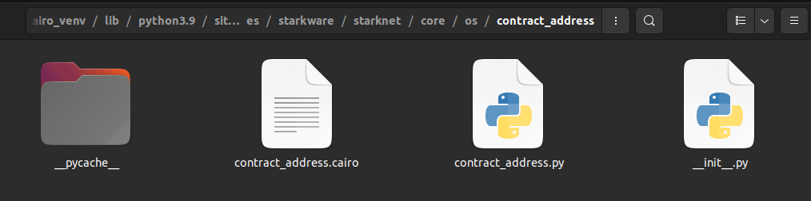
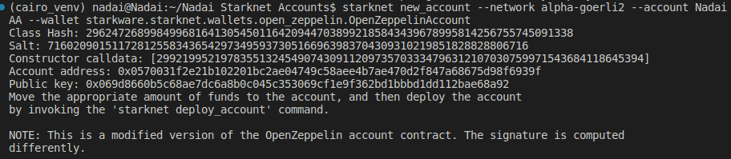
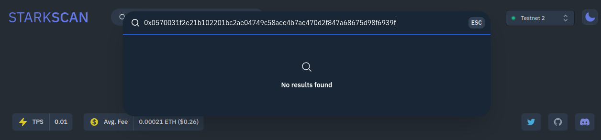
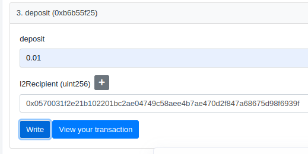
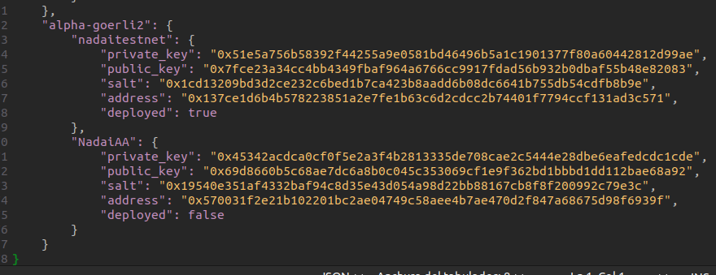
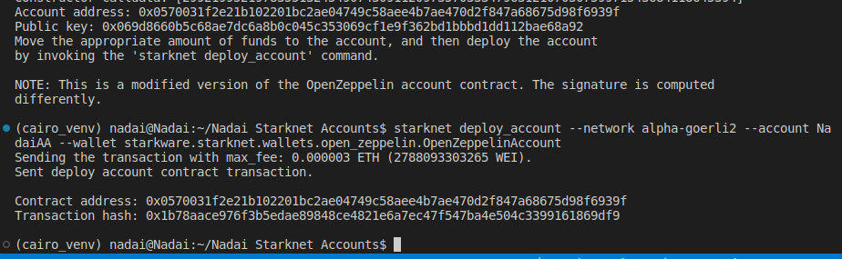
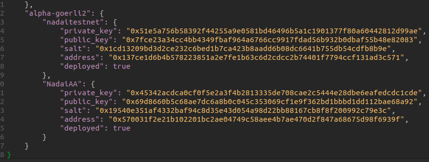
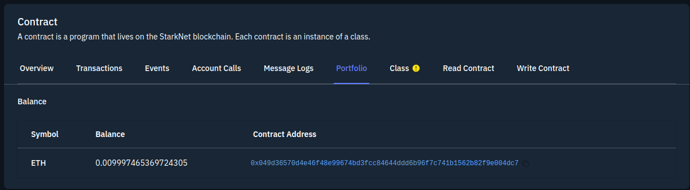

<div align="center">
    
    <h2>Recap Workpshop ¿Cómo deployar una Account Abstraction en Starknet?<h2>
</div>

Este documento es un Recap de los Workshop de las comunidades [L2 Español](https://t.me/s/l2espaniol) y [Starknetes](https://t.me/s/starknet_es).  Soy Nadai y quiero agradecer enormemente el esfuerzo realizado de ambos equipos para enseñarnos más sobre L2, Starknet y Cairo en estos talleres. En este documento en especial nos centraremos en los Workshop 6-7 sobre Account Abtraction, aprenderemos como calcular una address antes de ser deployada y crear nuestro Contrato de Cuenta.

## ¿Qué es la Abstraction Account?

> Definición 1: AA es cuando un **contrato inteligente puede pagar sus propias transacciones** ([Martin Triay, Devcon 6](https://www.youtube.com/watch?v=Osc_gwNW3Fw)). En otras palabras, los contratos abstractos (o contratos inteligentes de cuentas) pueden pagar las transacciones. Tenga en cuenta que no es lo mismo que cuentas de propiedad externa o billeteras inteligentes.

> Definición 2: AA es **abstracción de validación**. En L1 solo hay una forma de validar transacciones (recuperar una dirección de una firma, mirar esa dirección en el estado, determinar si el nonce está bien para la transacción que se envió y si la cuenta tiene saldo suficiente para realizar la transacción) . Con AA, **abstrae el proceso de validación**: utiliza diferentes tipos de firmas, primitivas criptográficas, procesos de ejecución, etc. ([lightclient, Devcon 6](https://app.devcon.org/schedule/9mvqce)) .

**Nota: En computación, el término abstracción se usa para generalizar algo. En este caso, estamos generalizando los contratos inteligentes: de la existencia de Externally Owned Contracts (EOA) y Contract Accounts (CA)  a simplemente contratos inteligentes.*


Aquí pueden encontrar la lista completa de los Workshop, así como el canal de Youtube oficial. ⭐⭐ Recuerden apoyar a las Repo y a los Videos⭐⭐


01. [Workshop Series StarkNet 01 - Introducción a L2](https://www.youtube.com/watch?v=s6vmWYkZoa8)
02. [Workshop Series StarkNet 02 - Ecosistema StarkNet](https://www.youtube.com/watch?v=KxUhBM3a6oM)
03. [Workshop Series StarkNet 03 - Creando en StarkNet](https://www.youtube.com/watch?v=elXLye41_b8&list=PL5LoUunXvIgLCdVerVBPZ2G3bR51Re251&index=3)
04. [Workshop Series StarkNet 04 - Desplegando en StarkNet Parte 1: Creando un NFT](https://www.youtube.com/watch?v=y3rJnaNRiGI&list=PL5LoUunXvIgLCdVerVBPZ2G3bR51Re251&index=4)
05. [Workshop Series StarkNet 05 - Desplegando en StarkNet Parte 2: URI y Metadata para un ERC-721](https://www.youtube.com/watch?v=SnaZjW2p3Io&list=PL5LoUunXvIgLCdVerVBPZ2G3bR51Re251&index=5)
06. [Workshop Series StarkNet 06 - Account Abstraction Pt. 1](https://www.youtube.com/watch?v=flnTFmEnjEQ)
07. [Workshop Series StarkNet 07 - Account Abstraction Pt. 2](https://www.youtube.com/watch?v=6vdP329tK_I)

- [Omar Espejel EN Tutoriales Walking-With-Starknet](https://github.com/starknet-edu/walking-with-starknet/tree/master/tutorials/tutorials/EN)
- [Nadai FORK ES Tutoriales Walking-With-Starknet](https://github.com/Nadai2010/walking-with-starknet/tree/master/tutorials/tutorials/ES)

En este tutorial aprenderemos el poder de las AA y como crear con Starknet un Contrato inteligente de cuentas. Los contratos abstractos (o contratos inteligentes de cuentas) pueden pagar las transacciones. Tenga en cuenta que no es lo mismo que cuentas de propiedad externa o billeteras inteligentes.

Puede revisar toda la información oficial en [README](/README.md) para no extendernos en este tutorial que hace referencia al [Workshop Series StarkNet 07 - Account Abstraction Pt. 2](https://www.youtube.com/watch?v=6vdP329tK_I).

---
## Configuración de Entorno 

Recomendamos trabajar dentro de un entorno virtual Python, pero también puede instalar el paquete Cairo directamente. Puede revisar [Ajustes de Entorno Starknet](https://www.starknet.io/docs/quickstart.html) y chequear su ultima VERSIÓN, para este tutorial tuvimos que actualizar a la versión `0.10.2` ya que nos daba algunos errores en comandos `Starknet`, asi que la descargamos desde [aquí directamente](https://github.com/starkware-libs/cairo-lang/releases/tag/v0.10.2). Para crear e ingresar al entorno virtual, abrimos una terminal (Ctrl+Alt+T):

```bash
python3.9 -m venv ~/cairo_venv
source ~/cairo_venv/bin/activate
```

Asegúrese de que venv esté activado; debería verlo (cairo_venv)en el indicador de la línea de comandos. Luego desde la carpeta que descargamos la actualización escribimos los comandos:

```bash
pip3 install cairo-lang-0.10.2.zip
```

Puede revisar su versión haciendo un:

```bash
cairo-compile --version
```

Deberá mostrar `cairo-compile 0.10.2`


**NOTA: En caso de error revise ajustes previos, también puede revisar una repo inicial [Nadai Starknet](https://github.com/Nadai2010/Cairo-0.10.0-Starknet-en-Ubuntu-22.04-con-Nile-y-VsCode.) para revisar los comandos de `Phyton`.

---
## Despliegue Contrato de Cuenta predeterminado

Aprenderemos a calcular previamenente los cálculos de (Public Key, Account address.) Pero primero tendremos que hacer unos ajustes para que la implementanción también nos calcule (Class Hash, Salt y Constructor calldata), para ello deberemos de ir a la raiz donde se encuentra el archivo `contract_address.py` en mi caso era `/home/nadai/cairo_venv/lib/python3.9/site-packages/starkware/starknet/core/os/contract_address/contract_address.py` y sustituirlo por [contract_address.py](/utils/contract_address.py)




Implementemos el contrato de cuenta predeterminado, inspirado en la implementación de Open Zeppelin, con el alias  `second-account` o el alias que escogan como `NadaiAA` en la red de prueba de Goerli 2.Puede recibir fondos en Testnet2 siguiendo una breve guía [aquí](https://github.com/Nadai2010/Nadai-Testnet-2-Starknet). El indicador `--wallet starkware.starknet.wallets.open_zeppelin.OpenZeppelinAccount` indica que usaremos el contrato de cuenta predeterminado, actualmente sólo podemos usar este contrato con la CLI.

```Bash
starknet new_account --network alpha-goerli2 --account NadaiAA --wallet starkware.starknet.wallets.open_zeppelin.OpenZeppelinAccount
```




En este paso hemos calculado el la dirección del Contrato de cuenta que vamos a implementar, hemos calculado una dirección `0x0570031f2e21b102201bc2ae04749c58aee4b7ae470d2f847a68675d98f6939f` la cual podremos cargar de saldo y deployar. Pero AÚN NO EXISTE, podemos ir a [Voyager Goerli2](https://goerli-2.voyager.online/) y comprobarlo.



---
## Enviar GoETH desde L1 Goerli hacia L2 Goerli2 Starknet

Ahora debemos enviarle saldo al Contrato que hemos calculado para poder ser deployado, para eso vamos a usar un Bridge desde L1 Goerli hacia L2 Goerli2, usaremos la opción `deposit` de [Este contrato Proxy Starknet](https://goerli.etherscan.io/address/0xaea4513378eb6023cf9ce730a26255d0e3f075b9#writeProxyContract#F3). Si quiere puede repasar la guía [Nadai Testnet2 Starknet](https://github.com/Nadai2010/Nadai-Testnet-2-Starknet), también les dejo por aquí algunos link directos para faucet.

Starknet L2
* https://faucet.goerli.starknet.io/

Goerli L1
* https://goerlifaucet.com/
* https://faucets.chain.link/
* https://faucet.paradigm.xyz/

Brdige Oficial
* https://goerli.starkgate.starknet.io/

Exploradores de Bloques Tesnet2
* https://testnet-2.starkscan.co/
* https://goerli-2.voyager.online/

En esta repo copiaremos `0x0570031f2e21b102201bc2ae04749c58aee4b7ae470d2f847a68675d98f6939f` y  haremos el depostio de `0.01 ETH` desde [Proxy Starknet](https://goerli.etherscan.io/address/0xaea4513378eb6023cf9ce730a26255d0e3f075b9#writeProxyContract#F3). 

**NOTA: Con esto estamos haciendo que sin NACER YA TENGA ETH**



* [HASH](https://goerli.etherscan.io/tx/0x2b4d65baea08e2d6553c61bf77447e2dcaaae77e75caa3266dfe85b107c0ee2f)

---

## Deploy Contrato de Cuenta

Ahora que ya tiene ETH para pagar su `Deploy` procederemos a buscar en nuestros archivos (Normalmente ocultos por un `.`, puede mostrarlos todos en Linux usando (Ctrl + h) en la carpeta que quiera buscar, o en terminal (ls -a) le aparecerán los ocultos) en mi caso estaban en `userNadai/.starknet_accounts/starknet_open_zeppelin_accounts.json`. Este muestra información relevante para la creación de cada contrato de cuenta. Por ejemplo, para la  `NadaiAA`  que creamos anteriormente tenemos:

```Bash
"NadaiAA": {
            "private_key": "XXX",
            "public_key": "0x69d8660b5c68ae7dc6a8b0c045c353069cf1e9f362bd1bbbd1dd112bae68a92",
            "salt": "0x19540e351af4332baf94c8d35e43d054a98d22bb88167cb8f8f200992c79e3c",
            "address": "0x570031f2e21b102201bc2ae04749c58aee4b7ae470d2f847a68675d98f6939f",
            "deployed": false
        }
    
```

**Nota que dice `"deployed": false` ya que no hemos desplegado el contrato.**




Y seguidamente para la implementación del `MISMO` contrato de cuenta y que éste pague por su autodespliegue, debemos usar los siguientes comandos (pero recuerde ajustar su `--account` con el ALIAS que haya escogido) en nuestro caso `NadaiAA`.

```bash
starknet deploy_account --network alpha-goerli2 --account NadaiAA --wallet starkware.starknet.wallets.open_zeppelin.OpenZeppelinAccount
```

Si todo ha ido bien deberá salir un mensaje de contrato creado, con su hash. Aqui puede comprobar que hemos deployado la misma dirección del contrato de cuenta que habiamos previamente calculado, y que habiamos mandado fondos para su `Deploy`.



* [HASH DEPLOY](https://testnet-2.starkscan.co/tx/0x01b78aace976f3b5edae89848ce4821e6a7ec47f547ba4e504c3399161869df9)


Ahora en el estado de `userNadai/.starknet_accounts/starknet_open_zeppelin_accounts.json` podemos revisar como cambió a `true`.




Ahora verificamos que en [Portafolio](https://testnet-2.starkscan.co/contract/0x0570031f2e21b102201bc2ae04749c58aee4b7ae470d2f847a68675d98f6939f#portfolio) tenemos el saldo enviado de `0.01` menos el Fee del deploy.



---
## Conclusiones finales

En este breve tutorial hemos querido reforzar como crear un Contrato de Cuenta en Starknet calculando primero su dirección, enviarle fondos y hacer el Deploy de este mismo Contrato de Cuenta. Hemos usado los comando de `Starknet` sin usar `Protostar`. Aunque también podrá realizarlos con Contratos modificados que no sean de Oppen Zeeppellin, como podría ser [oz_modified_account.cairo](/src/oz_modified_account.cairo), revise los videos para usar `Protostar`. 

Para poder comprender el verdadero poder de las AA en Starknet y profundizar es sus casos de uso puede revisar los siguientes link.

- [Workshop Series StarkNet 06 - Account Abstraction Pt. 1](https://www.youtube.com/watch?v=flnTFmEnjEQ)
- [Workshop Series StarkNet 07 - Account Abstraction Pt. 2](https://www.youtube.com/watch?v=6vdP329tK_I)
- [Traducción ES Tutoriales Walking-With-Starknet](https://github.com/Nadai2010/walking-with-starknet/tree/master/tutorials/tutorials/ES)

También puede revisar estos grandes articulos, algunos compartidos en este último gran WorkShop `L2 Español- Starknet`

- [Deployar Smart en Goerli 2](https://medium.com/@santiagodgalvan/deploying-a-contract-on-starknet-testnet-2-goerli-2-96803cba0f14)
- [Crea tu primer juego en cadena en Starknet](https://mirror.xyz/matchboxdao.eth/G8i8OUJsArc2F5v3ZGvsnRtYyzohTzQrzlkB_5atSHw)
- [Starknet Alpha 0.10.2](https://starkware.medium.com/starknet-performance-roadmap-bb7aae14c7de)
- [Starknet Alpha 0.8.0 FEE,AA](https://medium.com/starkware/starknet-alpha-0-8-0-16e046e0f94b)
- [Passkey Auth0](https://auth0.com/blog/our-take-on-passkeys/)
- [Github Cartridge](https://github.com/cartridge-gg/non-fungible-football)
- [Github Argent Starknet](https://github.com/argentlabs/argent-contracts-starknet)
- [Github Starknet-Edu EN Account](https://github.com/starknet-edu/starknet-accounts)
- [Github Starknet-Edu Nadai ES Account](https://github.com/Nadai2010/starknet-accounts/blob/answers/ES%20README.md)
